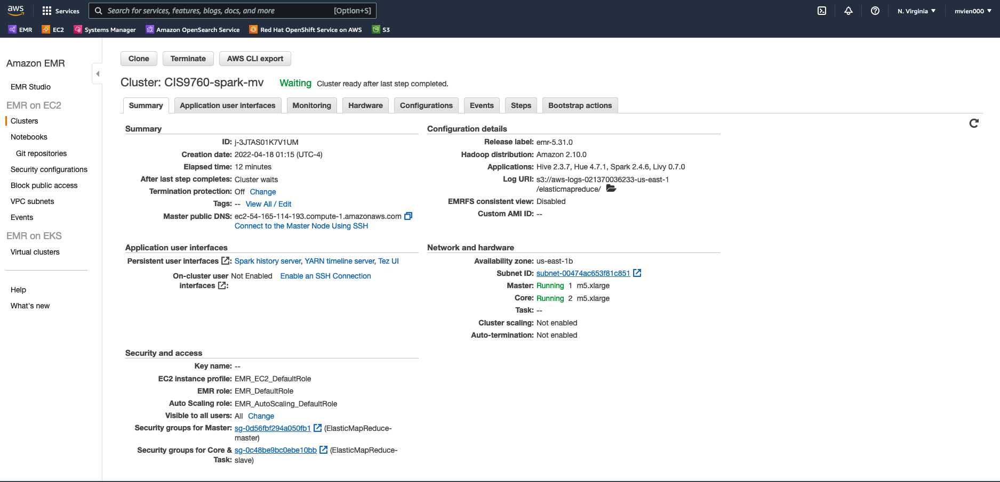
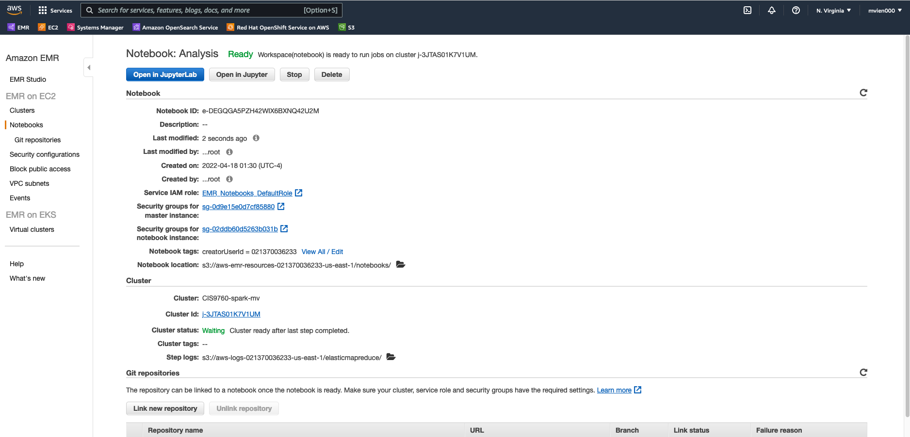

# Analysis_on_Yelp_Business_Public_Dataset
- Technology: AWS, S3, EMR
- Language: PySpark
- [Code and Analysis](Analysis.ipynb)

## Project Description

In this project, we will use PySpark in AWS EMR to analyze the Yelp public datasets from [Kaggle](https://www.kaggle.com/datasets/yelp-dataset/yelp-dataset) which are uploaded into AWS S3 bucket.

The datasets are over almost 10GB and can be accessed as below:  
```
business = spark.read.json('s3://cis9760-project-ii-mv/*business.json')
```
The notebook contains four parts with additional analysis.

- Part I: Installation and Initial Setup
- Part II:  Analyzing Categories
- Part III: Do Yelp Reviews Skew Negative?
- Part IV: Should the Elite be Trusted?
- Additional Analysis

## Cluster Configuration



## Notebook Configuration


